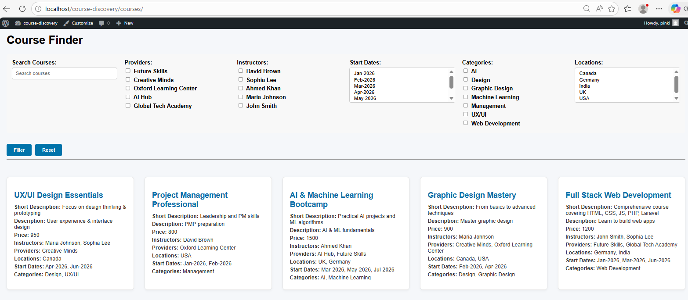

Course Discovery – WordPress Assignment
This project implements a Course Discovery system using WordPress with advanced filtering logic.

Features
Dynamic Search: Text-based search across course titles and content.

Robust Filtering: Multi-select filters for Providers, Locations, Categories, and Start Dates.

Derived Logic: Locations are dynamically pulled from linked Providers.

Reset Functionality: One-click reset to clear all active search parameters.

Responsive UI: A clean, grid-based layout for course cards.

Filter Logic
The discovery engine uses a compound query structure:

Top-level filters use AND logic (e.g., Category AND Provider).

Values within the same filter use OR logic (e.g., Provider A OR Provider B).

Example Query:
(provider = UOSD OR provider = DMU) AND (location = India OR location = China) AND (category = Graphic Design)

Setup Instructions
Install WordPress: Set up a local environment (XAMPP/LocalWP).

Clone Repository: Place the theme folder into wp-content/themes/.

Activate Theme: Go to Appearance → Themes and activate "Course Theme".

Import Data: Import the provided database/course-discovery.sql file via phpMyAdmin.

Configure: Update wp-config.php with your local database credentials.

Plugins: Ensure Advanced Custom Fields (ACF) is installed and active.

Access: Visit http://localhost/course-discovery/courses.

🧪 Testing & Regression Prevention
To prevent "breaking" filters during future updates, the following strategy is documented:

What to Test
Intersection Accuracy: Verify that selecting a "Category" correctly narrows down existing "Provider" results.

Serialized Match: Ensure Provider ID 2 does not pull results for ID 22 (handled via LIKE '"ID"' logic).

Empty States: Ensure a "No results found" message appears when criteria do not overlap.

High-Risk Areas (Common Bugs)
Meta Key Mismatch: Bugs often occur if the ACF "Field Name" is changed in the dashboard but not updated in the archive-course.php $args.

Reserved Terms: Using generic names like provider in the URL can clash with WordPress internals; this is prevented by using the f_provider prefix.

Regression Prevention
README Documentation: Future developers should refer to the $meta_query block in archive-course.php before adding new fields.

Manual Integration Tests: Before any deployment, test the "Reset" button to ensure the global $wp_query is restored.

🚀 Performance & Scalability
Potential Bottlenecks
The LIKE Operator: Current filters use LIKE for serialized arrays. While flexible, this prevents MySQL from using indexes, which will slow down once the site exceeds ~5,000 courses.

PHP Post-Processing: Locations are calculated in PHP after the initial DB query. On large datasets, this increases memory usage.

Scalability Redesign
For datasets exceeding 50,000 courses, the following redesign is recommended:

Custom Tables: Move meta-values into a custom "Flat Table" to allow for indexed SQL columns.

Taxonomy Migration: Convert "Providers" and "Start Dates" into Custom Taxonomies to utilize WordPress's optimized term_relationships tables.

External Indexing: Integrate Elasticsearch (via ElasticPress) to offload complex filtering from the MySQL server entirely.

🛠 Developer Troubleshooting
File Extensions: If .php or .css extensions are not visible, enable "Show File Name Extensions" in your OS settings (View > Show > File name extensions in Windows 11).

Gitignore: The .gitignore file is included to prevent node_modules, .env, and OS junk (like .DS_Store) from bloating the repository or leaking credentials.

ACF Return Format: The Provider relationship field is configured to return Post IDs for lightweight querying.

Demo Access
WordPress Admin: http://your-project-url.com/wp-admin

Username: pinki

Password: DRftgyhu12
## UI Preview

### Course Filter Page

## Accessibility
